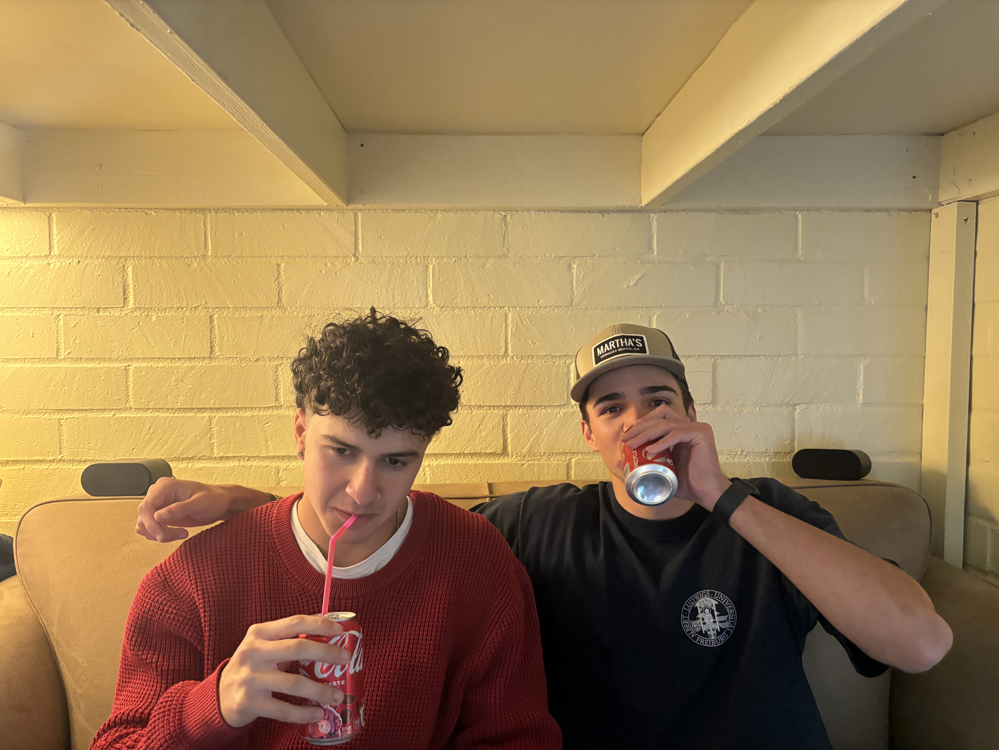
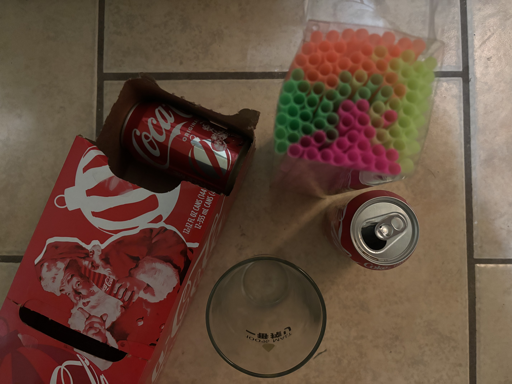
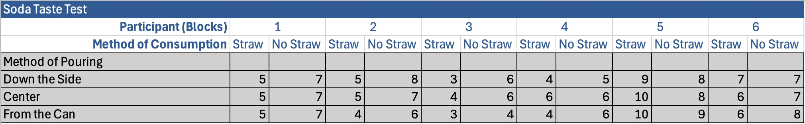

```{r setup, include=FALSE}
knitr::opts_chunk$set(echo = TRUE, warning = FALSE, message = FALSE)
```

```{r, echo=FALSE, message=FALSE, error=FALSE}
# library required dependencies
library(ggplot2)
library(knitr)
library(dplyr)
library(tibble)
```


# Introduction
\large
Carbonated beverages have been a staple in global consumer markets for over a century, with sensory perception playing a crucial role in their enjoyment. Beyond simple refreshment, the combination of carbonation, aroma, and taste significantly influences how individuals perceive beverages. Carbonation, in particular, is known to enhance flavor perception by stimulating sensory nerves, creating a tingling sensation that contributes to the overall experience and enjoyment. Meanwhile, aroma is a fundamental aspect of taste, as olfactory cues have a strong influence on flavor perception. Despite these well-documented effects, the specific influence of pouring and consumption methods on soda enjoyment remains underexplored.
\

The way a beverage is poured and consumed affects carbonation retention, aroma release, and the specific feelings the drinker experiences in their mouth, all of which are integral to the sensory experience. Pouring techniques may influence the amount of carbonation lost before consumption, which can impact perceived fizziness and enjoyment. Additionally, the method of consumption—such as drinking directly from a can, using a straw, or sipping from a glass—affects the way aroma interacts with taste. The use of a straw, for instance, may limit exposure to aroma, thereby altering the overall flavor experience (de Roos, 2003). Understanding these nuances is essential for both consumers and the beverage industry, as they can inform best practices for serving and marketing carbonated beverages.
\

This study aims to fill this gap by investigating the effects of pouring and consumption methods on the enjoyment of Coca-Cola. Specifically, we examine how three different pouring methods (down the side of the glass, directly into the center of the glass, and directly from the can) and two consumption methods (with or without a straw) influence perceived enjoyment. By employing a factorial design with blocking, this research seeks to isolate the effects of these variables while controlling for individual taste preferences by including blocks (as participants). The findings of this study contribute to a better understanding of sensory perception in carbonated beverages and may have practical implications for the food and beverage industry, as well as consumer preferences.
\

\normalsize

\newpage

# Methods
## Obtaining Data
The study involved 6 participants, each completing all combinations of a 3x2 factorial design, resulting in 36 observations.

### Data Collection Process
Participants were recruited from a sample of university students, aged 18–21, with no known aversions to carbonated beverages or Coca-Cola specifically. Each participant was instructed to taste Coca-Cola under six distinct conditions, determined by crossing two factors: method of pouring and method of consumption. The experiment was conducted in a single session per participant. Enjoyment was rated on a 1–10 scale (1 = least enjoyable, 10 = most enjoyable) immediately after each tasting. Participants rinsed their mouths with water between tastings to reset their sensory perception.

### Description of Factors and Blocks
The study included two factors and one blocking variable, described as follows:

1. **Method of Pouring (Factor 1)**: This factor had three levels, representing different techniques for pouring Coca-Cola from a 355 mL can. The levels were:
   - "Down the side": The can was tilted, and Coca-Cola was poured slowly along the inner side of a clear 12-ounce glass to preserve carbonation.
   - "Center": The can was held vertically, and Coca-Cola was poured directly into the center of the glass, potentially increasing carbonation release.
   - "From the can": Coca-Cola was consumed directly from the can without pouring into a glass, maintaining original carbonation.

2. **Method of Consumption (Factor 2)**: This factor had two levels, representing different ways participants consumed the Coca-Cola. The levels were:
   - "Straw": Participants drank Coca-Cola through a standard 6 mm diameter plastic straw, potentially altering aroma perception and limiting direct contact with the palate.
   - "No straw": Participants drank directly from the glass or can, allowing full exposure to aroma and taste.
   - Participants were asked to try their best to take a consistent sip for each rating.

3. **Participants (Blocks)**: The 6 participants served as blocks to account for individual variability in taste perception. Participants were assigned unique identifiers (1 through 10) and completed all 6 conditions. This blocking approach controls for individual differences in sensory sensitivity, ensuring that the effects of pouring and consumption methods are isolated from participant-specific biases.
\

The resulting dataset included 36 enjoyment ratings, with each participant contributing 6 ratings (one per condition). The data were stored in a rectangular data frame, with columns for `enjoyment` (numeric ratings), `method_pouring` (factor with 3 levels), `method_consumption` (factor with 2 levels), and `participant` (6 blocks).

## Data Collection Photographs
```{R out.width='49%', fig.show='hold', echo=FALSE}


```
\
\

## Statistical Methods Used

### Power Analysis
To ensure that the study had adequate statistical power:

- A **post-hoc power analysis** was conducted using observed effect sizes and variance estimates.
- This helped assess whether the sample size was sufficient to detect meaningful differences.

### Statistical Model Specification

A linear model was used to evaluate the effects of pouring and consumption methods on soda enjoyment. The model accounted for:

- **Main Effects**: The independent impact of pouring method and consumption method.
- **Interaction Effects**: Whether the combination of pouring and consumption methods produced an effect different from the sum of their individual impacts.
- **Blocking Variable**: Participants were included in the model to control for individual differences in taste preferences.

### Statistical Analysis Techniques

#### Hypothesis Testing
- **T-Tests for Coefficients**: Assessed the statistical significance of each factor’s contribution to the response variable (enjoyment).
- **F-Test for Overall Model Fit**: Evaluated whether the model significantly explained variation in enjoyment.
- **Partial F-Tests**: Used to determine the significance of individual factors and interactions by comparing reduced models to the full model.

\newpage

### Partial F-Tests

To isolate the effects of each factor while accounting for the blocking variable (participants), **Partial F-Tests** were conducted. These tests compared nested models:

1. **Testing the Overall Significance of the Factors of Interest**  
   - A reduced model containing only the blocking variable (participants) was compared to the full model, which included both factors (pouring method and consumption method) and their interaction.
   - **Null Hypothesis (\(H_0\))**: The experimental factors do not significantly affect enjoyment.
   - The **p-value from the ANOVA comparison** indicated whether the factors contributed significantly to the model.

2. **Testing the Effect of Pouring Method (with Interaction Included)**  
   - The full model was compared to a reduced model that excluded the pouring method.
   - **Null Hypothesis (\(H_0\))**: The pouring method and its interaction with the consumption method have no effect on enjoyment.

3. **Testing the Effect of Consumption Method (with Interaction Included)**  
   - A reduced model excluding the consumption method was compared to the full model.
   - **Null Hypothesis (\(H_0\))**: The consumption method and its interaction with the pouring method have no effect on enjoyment.

4. **Testing the Interaction Effect Alone**  
   - A reduced model excluding the interaction term was compared to the full model.
   - **Null Hypothesis (\(H_0\))**: The interaction between pouring and consumption methods does not impact enjoyment.


## Required Assumptions for Statistical Tests
The statistical methods used for this analysis require three main assumptions:

### 1. Normality

**Explanation**:

- The residuals (the differences between observed values and values predicted by the model) must be normally distributed. This is crucial for conducting reliable hypothesis tests on the regression coefficients.

**Why It Matters**:

- Ensures that statistical tests for coefficients are valid.

**How to Check**:

- Visualize residuals in a histogram or a Q-Q plot to assess normal distribution.
- Perform a Shapiro-Wilk test on residuals.

### 2. No Structure to the Data (Independence)

**Assumption Explanation**: 

- The residuals from the regression model are independent of each other. This is crucial to avoid autocorrelation.

**Why It Matters**:

- Independence of residuals ensures that there are no missing variables influencing the response.
- Violations can lead to biased estimates of regression coefficients.

**How to Check**:

- Plot residuals vs. time or the order of the data to detect any patterns.

### 3. Equality of Variances Among Fitted Values (Homoscedasticity)

**Assumption Explanation**:

- Homoscedasticity means that the variances of the residuals are constant across all levels of the independent variables.

**Why It Matters**:

- Ensures that the estimate of the variance of the coefficients is unbiased and consistent.

**How to Check**:

- Plot residuals vs. fitted values to look for a "funnel" shape, indicating heteroscedasticity.
\

**These assumptions are all satisfied with the data, and a thorough treatment is shown in the Results section**


## Data Collection Technical Issues
Potential technical issues that could have arisen during the data collection for the experiment:

1. **Inconsistent Sip Sizes**: Participants may have struggled to maintain a consistent sip size across conditions, particularly when using a straw versus drinking directly. This could introduce variability in enjoyment ratings, as larger or smaller sips might alter perceived taste or carbonation.
2. **Carbonation Loss During Pouring**: Despite standardized pouring techniques, minor inconsistencies in pouring speed or angle could have led to unintended carbonation loss, affecting enjoyment ratings across conditions.

\newpage

# Results
## Original Data Collected


## Sample Size Calculations

### Theoretical Framework
In a two-factor experiment where one factor has 3 levels, our linear model would look like this:
$$
y = \beta_0 + \beta_1x_1 + \beta_2x_2 + \beta_3x_3 + \beta_4x_1x_2 + \beta_5x_1x_3 + \epsilon
$$
The "effect size" is derived from the combination of all $\beta$ coefficients. To conduct power simulations, these coefficients and their variability are estimated from the collected data.

### Model Setup
The data was analyzed using a linear model that includes main effects, interactions, and participant blocks to estimate effect sizes and standard errors. 

```{r}
# Data entry and creation of data frame
enjoyment <- c(5, 7, 5, 8, 3, 6, 4, 5, 9, 8, 7, 7,
               5, 7, 5, 7, 4, 6, 6, 6, 10, 8, 6, 7,
               5, 7, 4, 6, 3, 4, 4, 6, 10, 9, 6, 8)
method_pouring <- c(rep("down the side", 12), 
                    rep("center", 12), 
                    rep("from the can", 12))
method_consumption <- rep(c("straw", "no straw"), 18)
participant <- rep(c("1", "1", "2", "2", "3", "3",
                     "4", "4", "5", "5", "6", "6"), 3)
soda_data <- data.frame(
  enjoyment = enjoyment,
  method_pouring = factor(method_pouring, levels = c("down the side", "center",
                                                     "from the can")),
  method_consumption = factor(method_consumption, levels = c("straw", "no straw")),
  participant = factor(participant)
)

# Fit linear model
full_model <- lm(enjoyment ~ method_pouring * method_consumption + participant, 
                 data = soda_data)

# Extract coefficients and standard errors
coefs <- coef(full_model)
se <- summary(full_model)$coefficients[, "Std. Error"]

beta_mean <- c(
  coefs["(Intercept)"],
  coefs["method_pouringcenter"],
  coefs["method_pouringfrom the can"],
  coefs["method_consumptionno straw"],
  coefs["method_pouringcenter:method_consumptionno straw"],
  0
)
beta_se <- c(
  se["(Intercept)"],
  se["method_pouringcenter"],
  se["method_pouringfrom the can"],
  se["method_consumptionno straw"],
  se["method_pouringcenter:method_consumptionno straw"],
  se["method_pouringfrom the can:method_consumptionno straw"]
)
```

### Post-Hoc Power Simulation
I then conducted a post-hoc power analysis using the F-statistic from the fitted linear model to determine the achieved power with the 6 participants at $\alpha$ = 0.05. The power was calculated based on the observed effect sizes and degrees of freedom from the model.
```{r}
source("power_factorial_32.R") 
# Attached function that estimates statistical power for a 3x2 factorial 
# design with interactions. It simulates outcomes based on input beta 
# coefficients and their standard errors, fits a linear model, and calculates
# the power by the proportion of significant results across iterations.

# Calculate achieved power with 6 participants
achieved_power <- power_factorial_32(beta_mean = beta_mean, beta_se = beta_se, 
                                     replicates = 6, iter = 1000, alpha = 0.05)

# Report achieved power
cat("Achieved power with 6 participants:", round(achieved_power, 3), "\n")
```
The post-hoc analysis confirmed that the 6 participants achieved a power of `r round(achieved_power, 3)` at $\alpha$ = 0.05, based on the observed effect sizes and variability. This exceeds the minimum threshold of 0.8, indicating that the sample size of 6 participants provides sufficient statistical power to detect the observed effects in this study.
\

### Power Analysis for Varying Relationships Between $\beta_1$ and $\beta_2$
```{r}
temp_beta_mean <- c(5.306, 0.5, -0.167, 1.333, -0.5, 0)
temp_beta_se <- c(0.542, 0.566, 0.566, 0.566, 0.800, 0.800)

power1 <- NA
power2 <- NA
power3 <- NA

beta2 <- seq(-2, 2, length.out=11)

for (i in 1:length(beta2)) {
  temp_beta_mean[3] <- beta2[i]
  power1[i] <- power_factorial_32(temp_beta_mean, temp_beta_se, replicates=3) 
}
  
temp_beta_mean[2] <- 0 
for (i in 1:length(beta2)) {
  temp_beta_mean[3] <- beta2[i]
  power2[i] <- power_factorial_32(temp_beta_mean, temp_beta_se, replicates=3)
}

temp_beta_mean[2] <- 0.25
for (i in 1:length(beta2)) {
  temp_beta_mean[3] <- beta2[i]
  power3[i] <- power_factorial_32(temp_beta_mean, temp_beta_se, replicates=3)
}

all_power2 <- data.frame(
  power = c(power1, power2, power3),
  beta1 = c(rep(0,11), rep(0.5,11), rep(0.25,11)),
  beta2 = rep(beta2, 3)
)

all_power2$beta1 <- as.factor(all_power2$beta1)

ggplot(data=all_power2, mapping=aes(y=power, x=beta2, group=beta1, color=beta1)) +
  geom_point() + geom_line() +
  labs(title=expression(paste("Power Analysis for Varying Relationships Between ", beta[1], " and ", beta[2])),
       x=expression(beta[2]), y="Power", color=expression(beta[1]))
```


\newpage

## Visualization of Results
```{r, fig.width=10}
ggplot(data = soda_data, mapping = aes(x = method_pouring, y = enjoyment, color = method_consumption)) + 
  geom_point(position = position_jitter(width = 0.2, height = 0)) +
  facet_grid(cols = vars(participant)) + 
  ggtitle("Enjoyment of Coca-Cola by 6 Participants") + 
  scale_x_discrete(limits = c("down the side", "center", "from the can")) + 
  scale_color_discrete(name = "Consumption Method", labels = c("straw", "no straw")) +
  labs(subtitle = "Participant", y = "Enjoyment", x = "Method of Pouring") +
  theme(axis.text.x = element_text(angle = 45, hjust = 1))
```

## Summary of Mean Enjoyment Scores Across Conditions
```{r}
summary_table <- soda_data %>%
  group_by(method_pouring, method_consumption) %>%
  summarise(mean_enjoyment = mean(enjoyment, na.rm = TRUE), .groups = "drop") %>%
  mutate(mean_enjoyment = round(mean_enjoyment, 2))  # Round to 2 decimal places

# Display the table
kable(summary_table, 
      caption = "Mean Enjoyment Scores by Pouring and Consumption Method",
      col.names = c("Pouring Method", "Consumption Method", "Mean Enjoyment Score"))
```

\newpage

## Statistical Analysis
We have two factors of interest, and the blocking variable…

- The blocking variable is not a factor of interest, but it DOES need to go in the model
- But, we do NOT care about its interaction with either factor
\

```{r}
model1 <- lm(enjoyment ~ method_pouring + method_consumption +
               method_pouring*method_consumption + participant, data=soda_data)
coef_table <- summary(model1)$coefficients
coef_table <- round(coef_table, 3)
coef_df <- as.data.frame(coef_table)
coef_df <- rownames_to_column(coef_df, var = "Predictor")
# Rename predictors to more readable labels
coef_df$Predictor <- recode(coef_df$Predictor, 
                            "(Intercept)" = "Intercept",
                            "method_pouringcenter" = "Pouring: Center",
                            "method_pouringfrom the can" = "Pouring: From the Can",
                            "method_consumptionno straw" = "Consumption: No Straw",
                            "participant2" = "Participant 2",
                            "participant3" = "Participant 3",
                            "participant4" = "Participant 4",
                            "participant5" = "Participant 5",
                            "participant6" = "Participant 6",
                            "method_pouringcenter:method_consumptionno straw" 
                            = "Pouring: Center * Consumption: No Straw",
                            "method_pouringfrom the can:method_consumptionno straw" 
                            = "Pouring: Center * Consumption: No Straw")

# Rename columns for clarity
colnames(coef_df) <- c("Predictor", "Estimate", "Std. Error", "t-value", "p-value")

coef_df$`p-value` <- format.pval(coef_df$`p-value`, digits = 3, eps = 0.001)

kable(coef_df, 
             caption = "Linear Model Coefficients",
             align = "lrrrr",
row.names=FALSE)# Align columns: left for Predictor, right for numbers
```

\newpage

From this model, we see that the only factor with statistically significant evidence is Consumption: No Straw. At a p-value of 0.027, we can reject the null hypothesis at $\alpha$ = 0.05 that there is no effect of the "Consumption: No Straw" condition on the response variable "enjoyment", suggesting that this factor does have a statistically significant impact. The coefficient means that when switching from drinking the soda with a straw to without a straw, the enjoyment rating will increase, on average, by around 1.333 points.
\

**Overall Model p-Value**
```{r}
f_statistic <- summary(model1)$fstatistic
f_value <- round(f_statistic[1], 3)
overall_p_value <- pf(f_value, f_statistic[2], f_statistic[3], lower.tail = FALSE)
cat("Overal Model p-Value: ", overall_p_value)
```

- The overall p-value is $2.624066\text{x}10^{-6}$, but this includes whether the blocks have an impact on the outcome variable and we don’t care about that.
- We can use a partial F-test to get an overall p-value for the two factors of interest.

**We compare the full model to a model with just operator in it:**

  - **model1**: $\hat{\text{enjoyment}}$ = method_pouring + method_consumption + method_pouring*method_consumption + participant
  - **model2**: $\hat{\text{enjoyment}}$ = participant
  - $H_0$: These terms have no impact on intensity

```{r}
model2 <- lm(enjoyment ~ participant)
comparison2 <- anova(model2, model1)
p_value2 <- comparison2$"Pr(>F)"[2]
cat("p-Value: ", p_value2)
```

The p-value is `r p_value2`. At $\alpha$ = 0.05, we can reject the null hypothesis and conclude that there is a statistically significant impact of some combination of our factors on enjoyment.
\
\

- What about individual factor effects?
   - We do partial F-tests for each of these as before, but with blocking variables always in the null model:
\
   
**Testing Pouring Method with its interaction with Consumption Method**
```{r}
model3 <- lm(enjoyment ~ method_pouring + participant, data=soda_data)
comparison3 <- anova(model3, model1)
p_value3 <- comparison3$"Pr(>F)"[2]
cat("p-Value: ", p_value3)
```

\newpage

**Testing Consumption Method with its interaction with Pouring Method**
```{r}
model4 <- lm(enjoyment ~ method_consumption + participant, data=soda_data)
comparison4 <- anova(model4, model1)
p_value4 <- comparison4$"Pr(>F)"[2]
cat("p-Value: ", p_value4)
```
\

**Testing the Interaction alone**
```{r}
model5 <- lm(enjoyment ~ method_pouring + method_consumption + participant, data=soda_data)
comparison5 <- anova(model5, model1)
p_value5 <- comparison5$"Pr(>F)"[2]
cat("p-Value: ", p_value5)
```
\

### Individual Results
```{r}
results <- data.frame(
  Effect = c("Pouring Method + interaction", "Consumption Method + interaction", "Interaction Itself"),
  p_Value = c(p_value3, p_value4, p_value5)
)
kable(results, caption="Individual Results")
```
Each of these should be compared to the Bonferroni-adjusted level of
$$
\frac{0.05}{3} \approx 0.0167
$$

- We find statistically significant evidence that the level of pouring method and its interaction with the consumption method has an impact on the enjoyment in which a participant experiences
- We DO NOT find statistically significant evidence for the consumption method and its interaction with the pouring method
- We DO NOT find statistically significant evidence of an interaction itself.

\newpage

## Findings
### 1. Method of Pouring and Consumption:
- **Significant Findings on Pouring Method**: The study found a statistically significant impact of the pouring method on enjoyment when considered alongside its interaction with the method of consumption. Specifically, the method of pouring the soda down the side versus pouring it into the center or directly from the can, when combined with how the soda is consumed (straw vs. no straw), affects the overall enjoyment.
- **Statistical Significance**: The effect of the pouring method combined with the method of consumption showed a significant p-value (0.0126005), suggesting a notable interaction effect.

### 2. Consumption Method ("No Straw"):
- **Enhanced Enjoyment Without a Straw**: Consumption without a straw is significantly more enjoyable, with a p-value of 0.027. This indicates that direct consumption (without a straw) possibly allows for a fuller sensory experience, enhancing aroma and flavor perception compared to drinking through a straw.

### 3. Interaction Effects:
- **Non-significant for Pure Interactions**: The analysis did not find significant effects from the interaction of pouring and consumption methods alone (p-value = 0.7730232), suggesting that the specific combinations of these methods do not independently affect enjoyment.
\
\

## Model Checking
\textbf{\underline{Normality}} 
\

**Histogram**
```{r, fig.width=4, fig.height=3, fig.align='center'}
hist(model1$residuals, xlab="residuals", main="Soda Taste Test Residuals")
```

From the shape of the histogram, we can conclude that the residuals follow a normal distribution, especially with the relatively low sample size.

**Q-Q Plot**
```{r, fig.width=4, fig.height=3, fig.align='center'}
qqnorm(model1$residuals)
qqline(model1$residuals)
```

The residuals seem to follow the Q-Q line as well, suggesting normality.
\
\

**Shapiro-Wilk Test**
```{r}
shapiro_test <- shapiro.test(model1$residuals)
cat("p-Value ", shapiro_test$p.value)
```

At $\alpha$ = 0.05, we conclude that there is not statistically significant evidence that the residuals do NOT follow a normal distribution. This means that we have not violated our normality assumption.

\newpage

### Structure to the Data
```{r, fig.width=4, fig.height=3, fig.align='center'}
x <- 1:length(model1$residuals)
plot(model1$residuals ~ x, ylab="Residuals",
     main="Residuals vs Order of Data Collection")
```

There are no apparent patterns in the graph, so there are no concerns about structure to the data that are able to be detected.

### Equality of Variances Across Fitted Values
```{r, fig.width=4, fig.height=3, fig.align='center'}
plot(model1$residuals ~ model1$fitted.values,
     xlab="Fitted Values", ylab="Residuals",
     main="Residuals vs Fitted Values")
```

There is no large concern about inequality of variances across fitted values based on the graph of residuals vs fitted values.

# Discussion
\large
The results of this study demonstrate that both the method of pouring and method of consumption significantly influence participants' enjoyment of Coca-Cola. Specifically, drinking without a straw significantly increased enjoyment, with a p-value of 0.027, suggesting that aroma perception and full contact with the palate enhance the sensory experience. Additionally, the pouring method had a statistically significant effect when considered alongside its interaction with the method of consumption (p = 0.0126), indicating that the way the soda is poured plays a role in carbonation retention and, consequently, overall enjoyment. However, the interaction between the two factors alone was not found to be statistically significant (p = 0.7730), suggesting that their combined effect does not deviate from their individual contributions.
\

These findings support previous research on beverage consumption, which suggests that carbonation, aroma, and sip dynamics play key roles in taste perception (de Roos, 2003). The increase in enjoyment when drinking without a straw aligns with studies indicating that olfactory cues contribute significantly to flavor perception (Djordjevic, 2004). Moreover, the effect of pouring methods suggests that carbonation retention influences sensory experience, as supported by prior literature on beverage aeration (Kersiene, 2023).
\

While the study achieved a high post-hoc power of `r round(achieved_power, 3)`, ensuring sufficient statistical strength, certain limitations should be noted. The small sample size of six participants limits generalizability, as individual taste preferences may have had a disproportionate impact on results. Additionally, sip consistency across conditions was self-regulated by participants, potentially introducing variability. The study attempted to mitigate these issues by employing a blocking design to control for individual differences, but future research with a larger, more diverse sample size would help validate these findings.
\

Assumptions of normality, independence, and homoscedasticity were assessed and found to be met, ensuring the validity of the statistical tests employed. Residual plots, histograms, and a Shapiro-Wilk test confirmed that residuals followed a normal distribution. Similarly, residual analysis demonstrated no patterns indicating data structure violations, and homoscedasticity checks suggested consistent variance across fitted values.
\

Future research should explore whether the observed effects persist across different brands of soda or beverage types, as carbonation levels and flavor profiles may yield different results. Additionally, further studies could investigate whether environmental factors, such as temperature or cup material, influence perceived enjoyment.
\

Overall, this study contributes to understanding how pouring and consumption methods impact beverage enjoyment, with practical implications for the beverage industry, hospitality sector, and consumers seeking to maximize their soda-drinking experience.
\

\normalsize

\newpage

# References
1. Djordjevic, Jelena, et al. "Odor-Induced Changes in Taste Perception." *Neuroscience Letters*, vol. 370, no. 3, 2004, pp. 185–190. *PubMed*, [https://pubmed.ncbi.nlm.nih.gov/15526194/](https://pubmed.ncbi.nlm.nih.gov/15526194/).

2. Kersiene, Monika, et al. "Dynamic Instrumental and Sensory Methods Used to Link Aroma Release and Aroma Perception: A Review." *Foods*, vol. 12, no. 14, 2023, article PMC10489873. *National Center for Biotechnology Information*, [https://pmc.ncbi.nlm.nih.gov/articles/PMC10489873/](https://pmc.ncbi.nlm.nih.gov/articles/PMC10489873/).

3. de Roos, Kees B. "Influence of Composition (CO2 and Sugar) on Aroma Release and Perception of Mint-Flavored Carbonated Beverages." *Journal of Agricultural and Food Chemistry*, vol. 51, no. 26, 2003, pp. 7641–7646. *ResearchGate*, [https://www.researchgate.net/publication/26280999_Influence_of_CompositionCO2_and_Sugar_on_Aroma_Release_and_Perception_of_Mint-Flavored_Carbonated_Beverages](https://www.researchgate.net/publication/26280999_Influence_of_CompositionCO2_and_Sugar_on_Aroma_Release_and_Perception_of_Mint-Flavored_Carbonated_Beverages).

